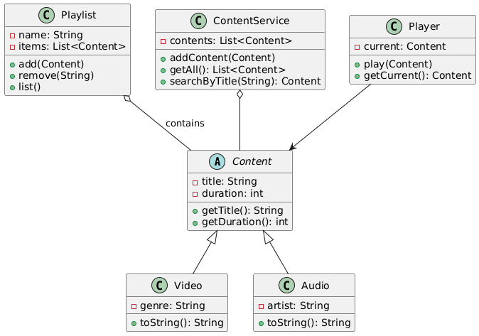

# SENA Viewer

Mini-aplicación de consola en Java que simula la gestión y reproducción de contenidos multimedia (videos y audios). Proyecto individual para la actividad GA1-220501096-04-AA1-EV06.

## Integrante
- Kelin Montoya — Desarrolladora / Documentación / Git Master

## Descripción
SENA Viewer demuestra el uso de Programación Orientada a Objetos en Java: herencia, encapsulamiento y polimorfismo. Permite crear y gestionar contenidos, crear playlists y reproducir títulos desde la consola.

## Estructura del proyecto

src/
└─ com/senaviewer/
├─ app/Main.java
├─ models/Content.java
├─ models/Video.java
├─ models/Audio.java
├─ models/Playlist.java
├─ player/Player.java
└─ utils/ContentService.java

## Requisitos
- JDK 17+
- Git
- VS Code o cualquier IDE Java

## Compilar y ejecutar (recomendado)
### Desde terminal (Git Bash / Linux)
```bash
mkdir -p out
javac -d out $(find src -name "*.java")
java -cp out com.senaviewer.app.Main

PowerShell (Windows)
New-Item -ItemType Directory -Force -Path out
$files = Get-ChildItem -Path ./src -Filter *.java -Recurse | ForEach-Object { $_.FullName }
javac -d out $files
java -cp out com.senaviewer.app.Main

Uso
Agregar Video / Audio
Listar contenidos
Buscar por título
Reproducir contenido
Crear y ver playlists
Salir

Diagrama de clases



Flujo de trabajo y entregables
Repositorio público: sena-viewer-kelly
Ramas: main, develop, feature/*
Mínimo 5 commits descriptivos
Pull Requests documentados
README completo y demo (captura o video)
Licencia
MIT

---

## 3) Diagrama UML 

```plantuml
@startuml
abstract class Content {
  - title: String
  - duration: int
  + getTitle(): String
  + getDuration(): int
}

class Video {
  - genre: String
  + toString(): String
}

class Audio {
  - artist: String
  + toString(): String
}

class Playlist {
  - name: String
  - items: List<Content>
  + add(Content)
  + remove(String)
  + list()
}

class ContentService {
  - contents: List<Content>
  + addContent(Content)
  + getAll(): List<Content>
  + searchByTitle(String): Content
}

class Player {
  - current: Content
  + play(Content)
  + getCurrent(): Content
}

Content <|-- Video
Content <|-- Audio
Playlist o-- Content : contains
ContentService o-- Content
Player --> Content
@enduml


### Desde terminal (Git Bash o Linux)
```bash
mkdir -p out
javac -d out $(find src -name "*.java")
java -cp out com.senaviewer.Main
